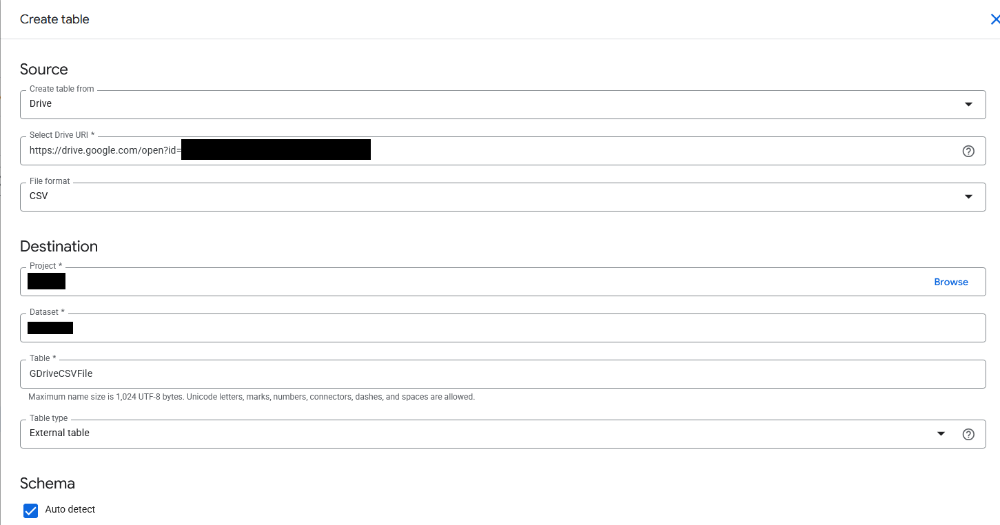

1\. Upload a CSV file in Drive.
No sharing settings are necessary, it only needs to be accessible to your user.


2\. Obtain the file ID from the URL of the file in Google Drive.
`https://drive.google.com/open?id=******`

3\. Create an external table in BigQuery using the file URL.



4\. Edit the following files in this repository:

- `client_secret.json`: Create [an installed-app OAuth client](https://github.com/googleapis/google-api-python-client/blob/main/docs/client-secrets.md)
  configuration that references your application. 

- `test.py`: Update the `BQ_PROJECT_ID` and `BQ_EXTERNAL_TABLE` variables with
  the value of your BigQuery project and the full table name respectively.

5\. Run the script. 
This will attempt to query the external table created in step 3 using the `drive.file` scope.
It should fail with the following exception:

```
google.api_core.exceptions.Forbidden: 403 Access Denied: BigQuery BigQuery: Permission denied while globbing file pattern.; reason: accessDenied, location: /gdrive/id/110vK7ZQzzIHL--UXwrPFC1Oa4CfUTem9, message: Access Denied: BigQuery BigQuery: Permission denied while globbing file pattern.
```

6\. Update the script so the `GDRIVE_SCOPE` variable uses the `drive` scope.
    This succeeds.
